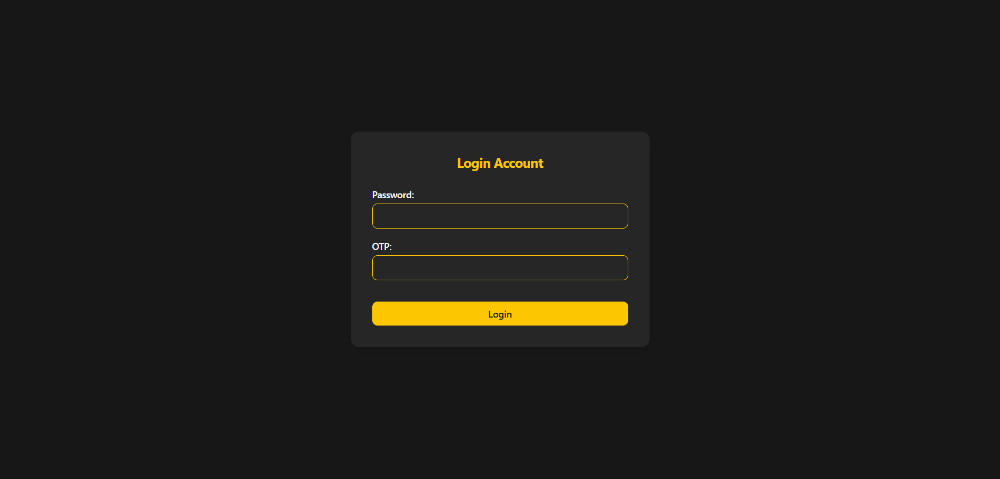
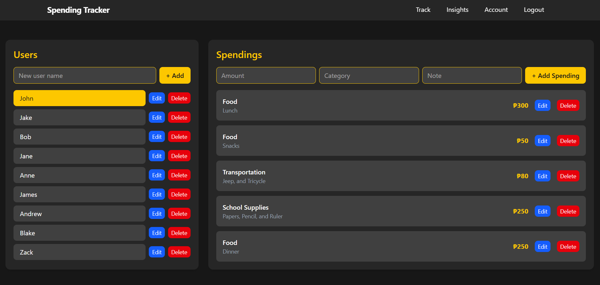
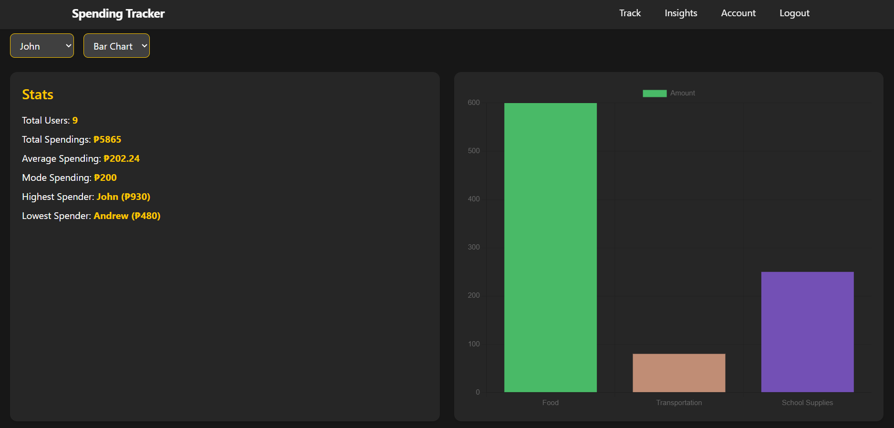
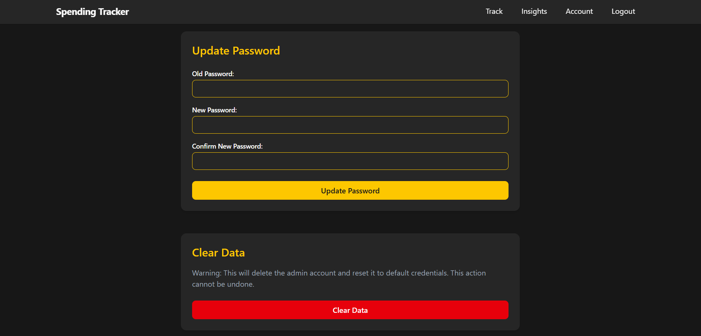

# Spending Tracker
A non-account system that tracks and generate data insights about your spending.

## Cloning Project:
- Clone this repository `git clone https://github.com/khianvictorycalderon/Spending-Tracker.git`

## Backend Setup:
1. `cd backend`
2. `npm install` to install dependencies.
3. Create an `.env` file inside the `backend` folder that contains:
  ```sql
  PORT=<your-available-port>
  CORS_ALLOW_ORIGIN=<your-frontend-origin>
  MONGODB_URI=<your-mongodb-url>
  ```
4. `npm run dev` to test the backend.

## Frontend Setup:
1. `cd frontend`
2. `npm install` to install dependencies.
3. Create an `.env` file inside the `frontend` folder that contains:
  ```sql
  VITE_API_URL=<your-express-url>
  ```
4. `npm run dev` to test the frontend.

## NOTE
- Make sure that PORT in the backend and PORT used in API URL in frontend are same
- Make sure that your frontend development and CORS_ALLOW_ORIGIN are same for development

## Previews







---

## Dependencies & Configuration
The following is a list of installed dependencies and configuration settings used in this project.
You don’t need to install anything manually, as all dependencies are already managed through `package.json`.
This section is provided for reference only, to give you insight into how the project was set up.

---

## Backend Dependencies
- `npm install express mongoose cors dotenv bcryptjs cookie-parser`
- `npm install --save-dev nodemon`

## Backend Configuration Dependencies
- Update `package.json`:
  ```json
  "scripts": {
    "start": "node server.js",
    "dev": "nodemon server.js"
  },
  ```

---

## Frontend Dependencies
- `npm install tailwindcss @tailwindcss/vite axios chart.js react-chartjs-2`

## Frontend Configuration Dependencies
- Update `vite.config.ts`:
  ```ts
  import tailwindcss from '@tailwindcss/vite'

  export default defineConfig({
    plugins: [
      tailwindcss(),
    ],
  })
  ```

---

## Mechanics (New Concept):

- Admin has one account only
- Admin logs in with default password of `admin123` and default OTP of `123456`.
- After logging in, Admin should immediately change the password.
- After each logout, a new OTP will be generated each time.
- Admin can now add users and track their spendings, and view data insights.